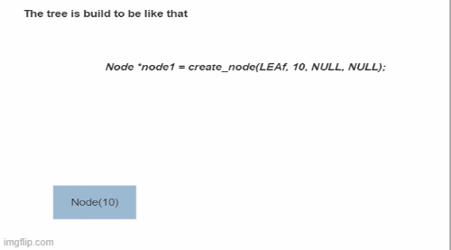
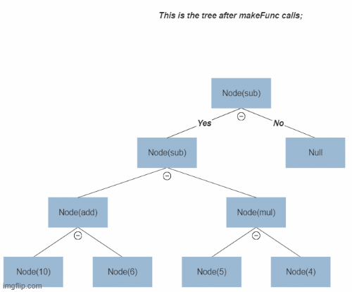

 # Question 1) Arithmetic Expression Evaluation with Fibonacci Support

## Assumption
As the problem statement was not clear enough, I made some assumptions to make the problem more clear and easy to solve:
1. The expression will be in the form of a binary tree.
2. The expression can contain the following operators: +, -, *, and /.
3. The last Node created with right node equal to null will perform the operation and return fibonacci of the result like in the given example.
   1. For each normal node when we call calc function the program will compute all the operation below if and store the result on that node and remove all nodes below it.
       ## Example of what makeFunc function does for each node
       * create_node function was created to create a new node with the given type and left and right nodes or to add a value directly to a node.
       * I have assumed that makeFunc will create a new node with TypeTage (ADD, SUB, MUL, DIV, FIB) and with operators left and right nodes as given in the function.
    
      
   
      ## Example of what calc function does for each node
       * calc function will compute the value of the node and store it in the node and remove all the nodes below it.
       * If the calce function is called for a node that is not a LEAF node and has right node null then I will compute the result the get FIB of the result.
         

## Code flow

This code implements an arithmetic expression evaluator that supports basic operations such as addition, subtraction, multiplication, and division. In addition, the evaluator also supports the Fibonacci function as a built-in operation.

The expression evaluation is performed using a binary tree structure, where each node represents an operation or a numeric value. The tree is constructed using the `create_node` and `makeFunc` functions, which allocate memory and set the appropriate values for the node's type, numeric value, and child nodes.

The `calc` function is used to evaluate the expression recursively, starting from the leaves of the tree and working upwards towards the root. The function performs the following steps:

1. If the current node is NULL or a leaf node, return immediately.
2. Recursively evaluate the left and right child nodes, if they exist. 
3. If the right child node is NULL, create a new leaf node and set the `shouldGetFib` flag to true. 
4. Evaluate the current node's operation by applying the appropriate arithmetic operation to the left and right child nodes' values. 
5. If `shouldGetFib` is true, calculate the Fibonacci number for the node's value and set it as the current node's value. 
6. Free the memory allocated for the child nodes and set them to NULL. 
7. Set the current node's type to `LEAF`, indicating that it contains a numeric value instead of an operation.

The `fibonacci` function is implemented using bottom up dynamic programing approach by following the following steps:

* The function takes an integer n as input, and returns the nth Fibonacci number. If n is 0 or 1, the function simply returns n. Otherwise, the function initializes f0 and f1 to 0 and 1 respectively, and then iterates from i = 2 up to n. At each iteration, it calculates f2 as the sum of f0 and f1, and then updates f0 and f1 to be equal to f1 and f2 respectively.

* At the end of the loop, f2 contains the nth Fibonacci number, which is then returned by the function.

This implementation of the Fibonacci sequence using a bottom-up approach is more efficient than the traditional recursive implementation, as it avoids redundant calculations and has a time complexity of O(n).

## Usage
To compile and run the code, you can use any C compiler such as gcc:
```bash
gcc -o question1 question1.c
question1
```
The output should show the result of evaluating the sample expression tree, which includes the Fibonacci function:
```bash
16
20
-4
2
```
